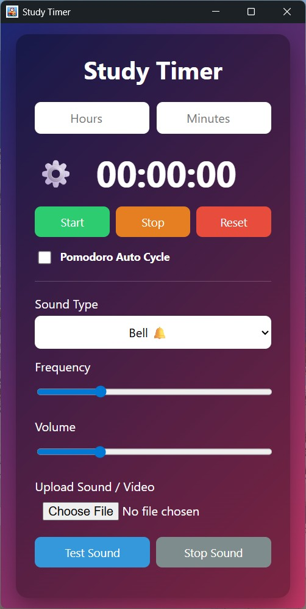
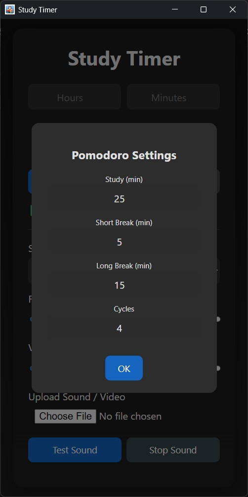
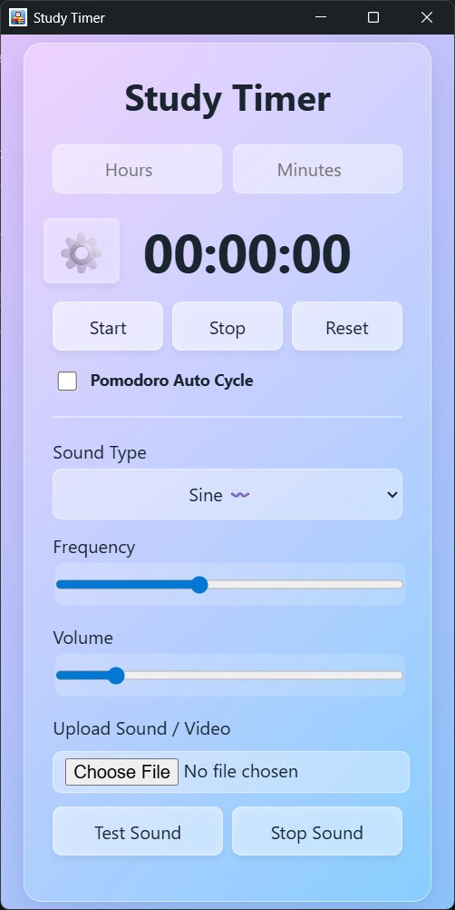
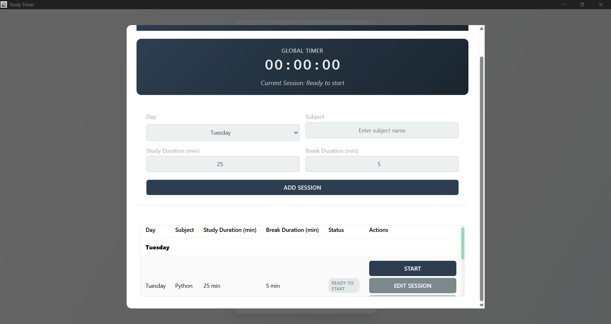

# Study Timer / مؤقت المذاكرة

##  English Description

### Overview
**Study Timer** is a desktop productivity application built with **Tauri** (Rust + JavaScript). It is designed to help users manage their study or work sessions effectively using a custom timer and the Pomodoro technique. The app is lightweight, supports background operation via the system tray, and can start automatically with Windows.

### Features
- **Timer & Pomodoro**
  - Custom timer (hours/minutes) with resume-on-start and background time check.
  - Pomodoro auto-cycle with adjustable Work/Short/Long durations and cycle count; automatic next session with notification.
- **Audio & Alerts**
  - Built-in sounds: Bell, Digital, Birds, Piano, Magic; and waveforms: Sine, Triangle, Square, Sawtooth.
  - Frequency and volume control; Test and Stop buttons.
  - Custom media upload (audio/video) with looping and volume control.
- **Notifications**
  - Native Tauri notifications; Web Notifications fallback when window is not focused (after permission).
- **UI & Themes**
  - Four themes: Primary, Dark, Light, Glassy.
  - Full support for Arabic UI.
- **System Integration**
  - Minimize to system tray with Show/Exit menu.
  - Autostart with Windows (with verification and user-friendly error handling).
  - Window positioned at the far right of the screen on launch.
- **Settings & Localization**
  - Settings modal: Language, Theme, Autostart.
  - i18n: Full English/Arabic strings with live updates for labels/placeholders.
  - Persisted preferences: sound type, frequency, volume, theme, language, timer state, autostart.
- **Weekly Study Schedule**
  - Weekly schedule for organizing study.
  - Ability to add subjects for each day with specific time durations.
  - Easy editing and deleting of subjects.

### Tech Stack
- **Frontend:** HTML, CSS, JavaScript (Vanilla)source files are inside `src-tauri/dist` folder.
- **Backend:** Rust (Tauri Framework).
- **Plugins:**
  - `tauri-plugin-autostart` for enabling automatic application startup with Windows.
  - `tauri-plugin-notification` for sending native system notifications (timer completion, Pomodoro transitions, background alerts).
  - `tauri-plugin-log` for centralized logging and debugging from both Rust and JavaScript.
  - `tauri-plugin-single-instance` to ensure only one instance of the application runs at a time.


### Installation & Development
1. **Prerequisites:**
   - Install [Node.js](https://nodejs.org/).
   - Install [Rust](https://www.rust-lang.org/).
   - Install C++ Build Tools (for Windows).

2. **Setup:**
   ```bash
   npm install
   ```

3. **Run in Development Mode:**
   ```bash
   npm run tauri dev
   ```

4. **Build for Production:**
   ```bash
   npm run tauri build
   ```

---

## وصف المشروع (العربية)

### نبذة عامة
**مؤقت المذاكرة** هو تطبيق سطح مكتب للإنتاجية مبني باستخدام إطار العمل **Tauri** (Rust + JavaScript). تم تصميم التطبيق لمساعدة المستخدمين على تنظيم جلسات المذاكرة أو العمل بفعالية باستخدام مؤقت مخصص وتقنية البومودورو. التطبيق خفيف الوزن، ويعمل في الخلفية من خلال شريط النظام (System Tray)، ويمكنه العمل تلقائياً عند بدء تشغيل ويندوز.

### المميزات
- **المؤقت والبومودورو**
  - مؤقّت مخصص بالساعات والدقائق، واستعادة الحالة عند التشغيل، ومراقبة الوقت في الخلفية حتى لا تفوت نهاية الجلسة.
  - دورة بومودورو تلقائية مع ضبط أوقات العمل/الاستراحة القصيرة/الطويلة وعدد الدورات؛ انتقال تلقائي للجلسة التالية مع إشعار.
- **الصوت والتنبيهات**
  - أصوات مدمجة: جرس، رقمي، عصافير، بيانو، سحر؛ وموجات: جيبية، مثلثية، مربعة، سن المنشار.
  - تحكم في التردد ومستوى الصوت؛ أزرار "تجربة الصوت" و"إيقاف".
  - دعم رفع ملفات صوت/فيديو مخصصة مع تكرار والتحكم في الصوت.
- **الإشعارات**
  - إشعارات أصلية عبر Tauri؛ وبديل إشعارات الويب عند عدم تركيز النافذة (بعد منح الإذن).
- **الواجهة والمظاهر**
  - أربع مظاهر: الأساسي، الداكن، الفاتح، الزجاجي.
  - دعم كامل  للغة العربية.
- **التكامل مع النظام**
  - تصغير إلى شريط النظام مع قائمة "إظهار/خروج".
  - بدء التشغيل مع ويندوز مع التحقق ورسائل خطأ ودّودة.
  - تموضع النافذة تلقائياً عند أقصى يمين الشاشة عند الإقلاع.
- **الإعدادات والتعريب**
  - نافذة إعدادات لاختيار اللغة والمظهر وبدء التشغيل.
  - i18n: نصوص كاملة بالعربية والإنجليزية مع تحديث فوري للعناوين والأزرار.
  - حفظ تفضيلات المستخدم (نوع الصوت، التردد، مستوى الصوت، المظهر، اللغة، حالة المؤقت، التشغيل التلقائي).
- **جدول المذاكرة الأسبوعي**
  - جدول أسبوعي لتنظيم المذاكرة.
  - إمكانية إضافة مواد لكل يوم مع مدة زمنية محددة.
  - تعديل وحذف المواد بسهولة.

### التقنيات المستخدمة
- **الواجهة الأمامية (Frontend):** HTML, CSS, JavaScript الملفات الاساسية داخل فولدر `src-tauri/dist`.
- **الخلفية (Backend):** Rust (عبر إطار العمل Tauri).
- **الإضافات:**
  - `tauri-plugin-autostart` لتمكين تشغيل التطبيق تلقائيًا مع نظام ويندوز.
  - `tauri-plugin-notification` لإرسال إشعارات نظام أصلية (انتهاء المؤقت، الانتقال بين جلسات البومودورو، والتنبيهات في الخلفية).
  - `tauri-plugin-log` لتسجيل الأحداث والأخطاء من Rust وواجهة JavaScript لأغراض التصحيح والمتابعة.
  - `tauri-plugin-single-instance` لضمان تشغيل نسخة واحدة فقط من التطبيق في نفس الوقت.


### التثبيت والتشغيل
1. **المتطلبات:**
   - تثبيت [Node.js](https://nodejs.org/).
   - تثبيت [Rust](https://www.rust-lang.org/).
   - تثبيت أدوات بناء C++ (لنظام ويندوز).

2. **التثبيت:**
   ```bash
   npm install
   ```

3. **تشغيل نسخة التطوير:**
   ```bash
   npm run tauri dev
   ```

4. **بناء النسخة النهائية:**
   ```bash
   npm run tauri build
   ```

## 📸 Screenshots
<p align="center">
  
  
  
  
  
</p>

## ⬇️ Download / تحميل

### ⚠ Antivirus Note 
During installation or the first run, your antivirus may take a few seconds to scan the application. This is normal behavior. Please allow it to finish — the program is completely safe and contains no harmful software.


Get the latest version of **Study Timer**:

👉 [Download latest release](https://github.com/ghonaime91/Study-Timer/releases/latest)

**Available versions:**
- Windows 64-bit (Recommended)  
- Windows 32-bit  

---

### ⚠ ملحوظة مضاد الفيروسات 
أثناء التثبيت أو عند التشغيل لأول مرة، قد يأخذ برنامج مكافحة الفيروسات بضع ثوانٍ لفحص التطبيق. هذا سلوك طبيعي. يُرجى الانتظار حتى ينتهي الفحص — البرنامج آمن تمامًا ولا يحتوي على أي برمجيات ضارة.

احصل على آخر نسخة من **مؤقت المذاكرة**:

👉 [اضغط هنا لتحميل آخر إصدار](https://github.com/ghonaime91/Study-Timer/releases/latest)

**الإصدارات المتوفرة:**
- ويندوز 64-بت (موصى بها)  
- ويندوز 32-بت


## License
This project is licensed under the MIT License.